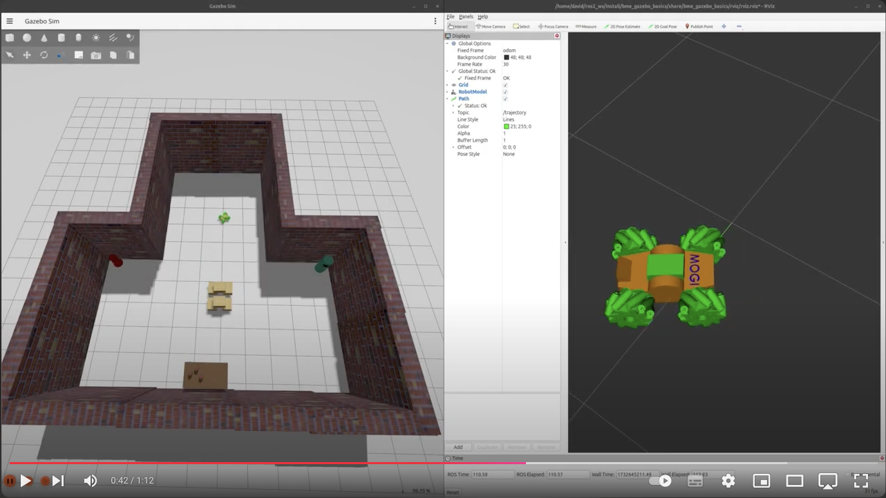
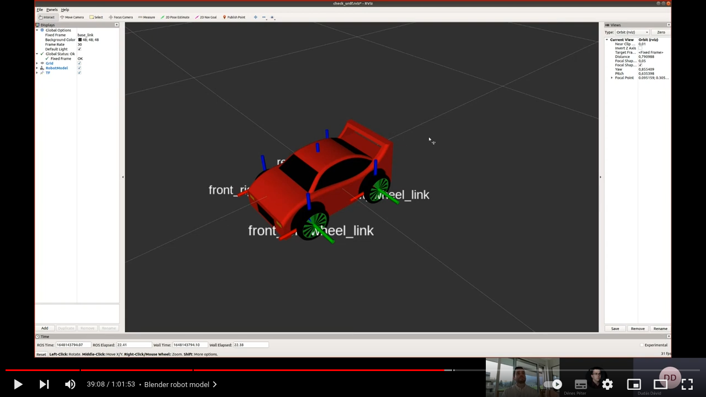

[//]: # (Image References)

[image1]: ./assets/gazebo.png "Shapes.sdf"
[image2]: ./assets/gazebo-1.png "Gazebo GUI"
[image3]: ./assets/gazebo-2.png "Gazebo models"
[image4]: ./assets/gazebo-3.png "Gazebo world"
[image5]: ./assets/gazebo-4.png "Gazebo world"
[image6]: ./assets/inertia.png "Robot inertia"
[image7]: ./assets/rviz.png "RViz"
[image8]: ./assets/rviz-1.png "RViz"
[image9]: ./assets/rviz-2.png "RViz"
[image10]: ./assets/rviz-3.png "RViz"
[image11]: ./assets/tf-tree.png "TF Tree"
[image12]: ./assets/rviz-4.png "RViz"
[image13]: ./assets/spawn.png "Spawn robot"
[image14]: ./assets/diff-drive.png "Differential drive"
[image15]: ./assets/diff-drive-1.png "Differential drive"
[image16]: ./assets/gazebo-5.png "Gazebo robot"
[image17]: ./assets/gazebo-6.png "Gazebo robot"
[image18]: ./assets/trajectory.png "Trajectory"
[image19]: ./assets/tf-tree-1.png "TF Tree"
[image20]: ./assets/rqt-graph.png "rqt_graph"
[image21]: ./assets/mogi-bot.png "mogi bot"
[image22]: ./assets/mogi-bot-1.png "mogi bot"
[image23]: ./assets/mogi-bot-2.png "mogi bot"
[image24]: ./assets/mogi-bot-3.png "mogi bot"
[image25]: ./assets/skid-steer.png "skid steer"
[image26]: ./assets/mecanum-wheel.png "mecanum wheel"

# Week 3-4: Gazebo basics

## This is how far we will get by the end of this lesson: 
  <a href="https://youtu.be/FuJuLnJy93g"></a>  


# Table of Contents
1. [What is Gazebo](#what-is-gazebo)
2. [Install Gazebo](#install-gazebo)  
2.1. [Run Gazebo examples](#run-gazebo-examples)  
3. [Download ROS package](#download-ros-package)  
4. [Creating a Gazebo world](#creating-a-gazebo-world)  
4.1. [Launch Gazebo world from ROS](#launch-gazebo-world-from-ros)  
5. [URDF](#urdf)  
5.1. [Building our robot 1](#building-our-robot-1)  
5.2. [View the robot in RViz](#view-the-robot-in-rviz)  
5.3. [Building our robot 2](#building-our-robot-2)  
5.4. [TF Tree](#tf-tree)  
5.5. [Add some colors](#add-some-colors)  
5.6. [Load the URDF in Gazebo](#load-the-urdf-in-gazebo)  
6. [Gazebo integration](#gazebo-integration)  
6.1. [Diff drive plugin](#diff-drive-plugin)  
6.2. [ROS gz bridge](#ros-gz-bridge)  
6.3. [Driving around](#driving-around)  
6.4. [Odometry and Trajectory server](#odometry-and-trajectory-server)  
7. [3D models](#3d-models)  
8. [Skid steer](#skid-steer)  
9. [Mecanum wheel](#mecanum-wheel)  

# What is Gazebo
Gazebo is a powerful robotics simulation tool that provides a 3D environment for simulating robots, sensors, and objects. It is widely used in the ROS ecosystem for testing and developing robotics algorithms in a realistic virtual environment before deploying them to real hardware.

Gazebo integrates tightly with ROS, enabling simulation and control of robots using ROS topics, services, and actions. In ROS2 with the latest Gazebo releases the integration is facilitated by `ros_gz`.

Key Features of Gazebo:

- 3D Physics Engine:
    Simulates rigid body dynamics, collision detection, and other physics phenomena using engines like ODE, Bullet, and DART.
- Realistic Sensors:
    Simulates cameras, LiDAR, IMUs, GPS, and other sensors with configurable parameters.
- Plugins:
    Extensible via plugins to control robots, customize physics, or add functionality.
- Worlds and Models:
    Enables users to create complex environments with pre-built or custom objects and robots.

Besides Gazebo, there are many alternative simulation environments for ROS, but usually the setup of these simulators are more complicated and less documented. Certain simulators also have very high requirements for the GPU.

| **Simulator** | **Best For**                          | **Advantages**                      | **Disadvantages**                           |
|---------------|---------------------------------------|-------------------------------------|---------------------------------------------|
| **Gazebo**    | General robotics simulation in ROS    | Free, accurate physics, ROS support | Moderate visuals, resource-heavy            |
| **Unity**     | High-fidelity visuals and AI/ML tasks | Realistic graphics, AI tools        | Steep learning curve, not robotics-specific |
| **Webots**    | Beginner-friendly robotics simulation | Easy setup, cross-platform          | Limited graphics, less customizable         |
| **Isaac Sim** | High-end AI and robotics simulation   | High-fidelity physics, AI support   | GPU-intensive, complex setup                |


# Install Gazebo

Before we install Gazebo we have to understand the compatibility between Gazebo versions and ROS distributions.

| **ROS Distribution** | **Gazebo Citadel (LTS)** | **Gazebo Fortress (LTS)** | **Gazebo Garden** | **Gazebo Harmonic (LTS)** | **Gazebo Ionic** |
|-----------------------|--------------------------|---------------------------|-------------------|---------------------------|------------------|
| **ROS 2 Rolling**     | ❌                        | ❌                         | ⚡                 | ⚡                         | ✅                |
| **ROS 2 Jazzy (LTS)** | ❌                        | ❌                         | ⚡                 | ✅                         | ❌                |
| **ROS 2 Iron**        | ❌                        | ✅                         | ⚡                 | ⚡                         | ❌                |
| **ROS 2 Humble (LTS)**| ❌                        | ✅                         | ⚡                 | ⚡                         | ❌                |
| **ROS 2 Foxy (LTS)**  | ✅                        | ❌                         | ❌                 | ❌                         | ❌                |
| **ROS 1 Noetic (LTS)**| ✅                        | ⚡                         | ❌                 | ❌                         | ❌                |

Since we use the latest LTS ROS2 distribution, Jazzy, we need Gazebo Harmonic.

To install Gazebo Harmonic binaries on Ubuntu 24.04 simply follow the steps [on this link](https://gazebosim.org/docs/harmonic/install_ubuntu/).

Once it's installed we can try it with the following command:
```bash
gz sim shapes.sdf
```

If everything works well you should see the following screen:
![alt text][image1]

If you have a problem with opening this example `shapes.sdf` there might be various reasons that requires some debugging skills with Gazebo and Linux.

- If you see a `Segmentation fault (Address not mapped to object [(nil)])` due to problems with `Qt` you can try to set the following environmental variable to force Qt to use X11 instead of Wayland. [Link](https://robotics.stackexchange.com/questions/111547/gazebo-crashes-immediately-segmentation-fault-address-not-mapped-to-object-0)
    ```bash
    export QT_QPA_PLATFORM=xcb
    ```

- If you run Gazebo in WSL2 or virtual machine the most common problem is with the 3D acceleration with the OGRE2 rendering engine of Gazebo. You can either try disabling HW acceleration (not recommended) or you can switch the older OGRE rendering engine with the following arguments. [Link](https://github.com/gazebosim/gz-sim/issues/1492)
    ```bash
    gz sim shapes.sdf --render-engine ogre
    ```

- If you run Ubuntu natively on a machine with an integrated Intel GPU and a discrete GPU you can check [this troubleshooting guide](https://gazebosim.org/docs/harmonic/troubleshooting/#problems-with-dual-intel-and-nvidia-gpu-systems).

After Gazebo successfully starts we can install the Gazebo ROS integration with the following command:
```bash
sudo apt install ros-jazzy-ros-gz
```

You can find the official install guide [here](https://gazebosim.org/docs/harmonic/ros_installation/).

## Run Gazebo examples

Let's start again the `gz sim shapes.sdf` example again and let's see what is important on the Gazebo GUI:
![alt text][image2]

1. Blue - Start and pause the simulation. By default Gazebo starts the simulation paused but if you add the `-r` when you start Gazebo it automatically starts the simulation.
2. Cyan - The display shows the real time factor. It should be always close to 100%, if it drops seriously (below 60-70%) it's recommended to change the simulation step size. We'll see this later.
3. Red - You can add basic shapes or lights here and you can move and rotate them.
4. Pink - The model hierarchy, every item in the simulation is shown here, you can check the links (children) of the model, their collision, inertia, etc.
5. Green - Detailed information of the selected model in `4.` some parameters can be changed most of them are read only.
6. Plug-in browser, we'll open useful tools like `Resource Spawner`, `Visualize Lidar`, `Image Display`, etc.

Gazebo has an online model database available [here](https://app.gazebosim.org/), you can browse and download models from here. Normally this online model library is accessible within Gazebo although there might be issues in WSL2 or in virtual machines, so I prepared an offline model library with some basic models.

You can [download this offline model library](https://drive.google.com/file/d/1tcfoLFReEW1XNHPUAeLpIz2iZXqQBvo_/view?usp=share_link) from Google Drive.

After download unzip it and place it in the home folder of your user. To let Gazebo know about the offline model library we have to set the `GZ_SIM_RESOURCE_PATH` environmental variable, the best is to add it to the `.bashrc`:
```bash
export GZ_SIM_RESOURCE_PATH=~/gazebo_models
```

After setting up the offline model library let's open the `empty.sdf` in Gazebo and add a few models through the `Resource Spawner` within the `plug-in browser`:
![alt text][image3]


# Download ROS package

From now, every lesson has a starter package that you can donwload from GitHub. To download the starter package clone the following git repo with the right branch (with the `-b branch` flag) to your colcon workspace:
```bash
git clone -b starter-branch https://github.com/MOGI-ROS/Week-3-4-Gazebo-basics.git
```

Let's see what's inside the `bme_gazebo_basics` package with the `tree` command!

```bash
.
├── CMakeLists.txt
├── package.xml
├── meshes
│   ├── mecanum_wheel_left.STL
│   ├── mecanum_wheel_right.STL
│   ├── mogi_bot.blend
│   ├── mogi_bot.dae
│   ├── mogi_bot.SLDPRT
│   ├── mogi_bot.STEP
│   ├── mogi_bot.STL
│   ├── wheel.blend
│   ├── wheel.dae
│   ├── wheel.SLDPRT
│   ├── wheel.STEP
│   └── wheel.STL
├── rviz
│   ├── rviz.rviz
│   └── urdf.rviz
├── urdf
│   └──materials.xacro
└── worlds
    ├── empty.sdf
    └── world.sdf
```

There are a few folders that we didn't met before:
- meshes: this folder contains the 3D models in `dae` format (collada mesh) that we'll use later for our robot's body and wheels. In this lesson it also includes the SolidWorks and Blender models as reference, but it's not needed for the simulation.
- rviz: pre-configured RViz2 layouts that we can use to display the robot's model and the environment
- urdf: URDF = Universal Robot Description Format. We'll create the model of our robots in this folder. It already has a file with color codes and names.
- worlds: we'll store the Gazebo worlds that we use in the simulation. In the next chapter we learn how to create a Gazebo world.

# Creating a Gazebo world

Before we create a new world, let's see how can we open the example `world.sdf`. Let's navigate to the `worlds` folder and run the following command:

```bash
gz sim world.sdf
```

> In case you have problem with the default OGRE2 rendering engine you can switch to OGRE:
> ```bash
> gz sim world.sdf --render-engine ogre
> ```

And it should open the example world I created for this package.
![alt text][image4]

Now let's switch to the empty template:
```bash
gz sim empty.sdf
```

Build a world you like using the resource spawner and in the end save it into the worlds folder with `sdf` extension.
![alt text][image5]

## Launch Gazebo world from ROS

After we created the new world file, let's see how can we launch Gazebo and load the world using ROS. First, let's create a `launch` folder within the package. Inside this folder let's create a new launch file `world.launch.py`.

```python
import os
from ament_index_python.packages import get_package_share_directory
from launch import LaunchDescription
from launch.actions import DeclareLaunchArgument, IncludeLaunchDescription
from launch.launch_description_sources import PythonLaunchDescriptionSource
from launch.substitutions import  LaunchConfiguration, PathJoinSubstitution, TextSubstitution


def generate_launch_description():

    world_arg = DeclareLaunchArgument(
        'world', default_value='world.sdf',
        description='Name of the Gazebo world file to load'
    )

    pkg_bme_gazebo_basics = get_package_share_directory('bme_gazebo_basics')
    pkg_ros_gz_sim = get_package_share_directory('ros_gz_sim')

    # Add your own gazebo library path here
    gazebo_models_path = "/home/david/gazebo_models"
    os.environ["GZ_SIM_RESOURCE_PATH"] += os.pathsep + gazebo_models_path


    gazebo_launch = IncludeLaunchDescription(
        PythonLaunchDescriptionSource(
            os.path.join(pkg_ros_gz_sim, 'launch', 'gz_sim.launch.py'),
        ),
        launch_arguments={'gz_args': [PathJoinSubstitution([
            pkg_bme_gazebo_basics,
            'worlds',
            LaunchConfiguration('world')
        ]),
        #TextSubstitution(text=' -r -v -v1 --render-engine ogre')],
        TextSubstitution(text=' -r -v -v1')],
        'on_exit_shutdown': 'true'}.items()
    )

    launchDescriptionObject = LaunchDescription()

    launchDescriptionObject.add_action(world_arg)
    launchDescriptionObject.add_action(gazebo_launch)

    return launchDescriptionObject
```

This launch file has one argument, the world file's name - you can change the default value to your new world. It also ensures that the offline Gazebo model folder is added to the environmental variable, and finally it launches Gazebo through the `ros_gz_sim` with the right arguments (note that the simulation will start automatically because of the `-r` flag).

> In case you have problem with the default OGRE2 rendering engine you can switch to OGRE as before:
> ```python
> TextSubstitution(text=' -r -v -v1 --render-engine ogre')],
> ```

Let's build the workspace - if this is the first time that you build this package source the workspace - and we can launch our file:

```bash
ros2 launch bme_gazebo_basics world.launch.py
```

# URDF

URDF is Universal Robot Description Format, it's an XML format for representing a robot model commonly used in ROS, RViz and Gazebo.

However, we still call it URDF, in practice it also includes the functionalaties of `xacro`, in its full name XML macros. With `xacro` we can define re-usable constants, do basic mathematical calculations and substitute complete blocks of our robots with parametrized macros. It can be useful for example in case of a 6 DoF robot arm where all links and joints are identical with different length, diameter, weight, etc.

A robot description (3D model) in URDF is built up as the tree of links and joints that connects links together. A parent link can have multiple children, but a link can only have a single parent.

In the links we can define the mechanical parameters of the link (weight, inertia), the collision shape for the physical simulation and it's visual properties (e.g. detailed 3D models).

In the joints we define the parent and child links and we tell to the simulation what kind of joint do we have (fixed, rotation or linear).

For more detailed tutorials you can check out the official documentation [here](https://docs.ros.org/en/jazzy/Tutorials/Intermediate/URDF/URDF-Main.html).

## Building our robot 1

First of all let's create our robot's URDF in the `urdf` folder with `mogi_bot.urdf` name. To start from the bare minimum let's add the following xml code to the file.

```xml
<?xml version='1.0'?>

<robot name="mogi_bot" xmlns:xacro="http://www.ros.org/wiki/xacro">

  <!-- STEP 1 - Robot footprint -->
  <link name="base_footprint"></link>

</robot>
```

Now we only have the very first link of our robot without any mechanical, collision or visual properties, there is nothing to see yet.

Let's add a fix joint and the next link - `base_link` - that will be the body of our robot. It's a 40x20x10cm brick with 15kg, the inertia matrix is calculated from these parameters.
![alt text][image6]

It's always very important to set realistic values into the inertia matrix, at least the order of magnitude should be in the right range. If the inertia matrix is set to a very unrealistic value it will cause unwanted effects during the physical simulation.

To quickly calculate the inertia matrix from the mechanical parameters you can use various tools, for example [this online calculator](https://www.omnicalculator.com/physics/mass-moment-of-inertia), or you can write a `xacro macro` for that.

> A `xacro` for calculating the inertia of a box can be the following:
> ```xml
> <xacro:macro name="solid_cuboid_inertia" params="m l w h">
>   <inertia ixx="${(m*(w*w+h*h))/12}" ixy = "0" ixz = "0"
>            iyy="${(m*(l*l+h*h))/12}" iyz = "0"
>            izz="${(m*(l*l+w*w))/12}"
>   />
> </xacro:macro>
> ```

We always have to think and verify the values if we use `xacro`, during these lessons I'll always use the numeric values for the better understanding. Let's add the robot body with the above parameters:

```xml
  <!-- STEP 2 - Robot chassis = base_link -->
  <joint name="base_footprint_joint" type="fixed">
    <origin xyz="0 0 0" rpy="0 0 0" />
    <parent link="base_footprint"/>
    <child link="base_link" />
  </joint>

  <link name='base_link'>
    <pose>0 0 0.1 0 0 0</pose>

    <inertial>
      <mass value="15.0"/>
      <origin xyz="0.0 0 0" rpy=" 0 0 0"/>
      <inertia
          ixx="0.0625" ixy="0" ixz="0"
          iyy="0.2125" iyz="0"
          izz="0.25"
      />
    </inertial>

    <collision name='collision'>
      <origin xyz="0 0 0" rpy=" 0 0 0"/> 
      <geometry>
        <box size=".4 .2 .1"/>
      </geometry>
    </collision>

    <visual name='base_link_visual'>
      <origin xyz="0 0 0" rpy=" 0 0 0"/>
      <geometry>
        <box size=".4 .2 .1"/>
      </geometry>
    </visual>
  </link>
```

> Links and joints always have to be inside the <robot> tag of the URDF!

## View the robot in RViz

Now we have a robot body that we can visualize. ROS provides several powerful tools to visualize various data, we already met `rqt` now we meet `RViz`.

We can start it with the `rviz2` command. Then we can add (1) the `Robot Model` view (2), we browse for our URDF file (3) and we type `base_link` as Fixed Frame (4).
![alt text][image7]

Although is possible to use RViz like this, it's not the most convinient way. Later, when we add more links and joints we'll have the problem that the we don't have any program running that informs RViz about the right transformation among these links (if the joint isn't fixed).

Instead of this manual usage of RViz, let's move all these tasks into a ROS launch file.

We have to install a few packages first:
```bash
sudo apt install ros-jazzy-urdf
sudo apt install ros-jazzy-urdf-tutorial 
sudo apt install ros-jazzy-urdf-launch
```

Let's try what can we do with the `urdf-tutorial` package:
```bash
ros2 launch urdf_tutorial display.launch.py model:=urdf/01-myfirst.urdf
```

The source of this package is available [here](https://github.com/ros/urdf_tutorial/tree/ros2). This package does exactly what we need, but we cannot build up our tools onto `urdf-tutorial`, it's not suitable, but we can create our own launch file based on this package! Let's create the `check_urdf.launch.py` file in the launch folder with the following content:

```python
import os
from launch import LaunchDescription
from launch.actions import DeclareLaunchArgument, IncludeLaunchDescription
from launch.substitutions import LaunchConfiguration, PathJoinSubstitution
from launch_ros.substitutions import FindPackageShare


def generate_launch_description():
    
    pkg_bme_gazebo_basics = FindPackageShare('bme_gazebo_basics')
    default_rviz_config_path = PathJoinSubstitution([pkg_bme_gazebo_basics, 'rviz', 'urdf.rviz'])

    # Show joint state publisher GUI for joints
    gui_arg = DeclareLaunchArgument(name='gui', default_value='true', choices=['true', 'false'],
                                    description='Flag to enable joint_state_publisher_gui')
    
    # RViz config file path
    rviz_arg = DeclareLaunchArgument(name='rvizconfig', default_value=default_rviz_config_path,
                                    description='Absolute path to rviz config file')
    

    # URDF model path within the bme_gazebo_basics package
    model_arg = DeclareLaunchArgument(
        'model', default_value='mogi_bot.urdf',
        description='Name of the URDF description to load'
    )

    # Use built-in ROS2 URDF launch package with our own arguments
    urdf = IncludeLaunchDescription(
        PathJoinSubstitution([FindPackageShare('urdf_launch'), 'launch', 'display.launch.py']),
        launch_arguments={
            'urdf_package': 'bme_gazebo_basics',
            'urdf_package_path': PathJoinSubstitution(['urdf', LaunchConfiguration('model')]),
            'rviz_config': LaunchConfiguration('rvizconfig'),
            'jsp_gui': LaunchConfiguration('gui')}.items()
    )

    launchDescriptionObject = LaunchDescription()

    launchDescriptionObject.add_action(gui_arg)
    launchDescriptionObject.add_action(rviz_arg)
    launchDescriptionObject.add_action(model_arg)
    launchDescriptionObject.add_action(urdf)

    return launchDescriptionObject
```

From now, in every lesson we'll create this launch file, because it's extremely useful during development to visualize our URDF. Build the workspace and let's try it:
```bash
ros2 launch bme_gazebo_basics check_urdf.launch.py 
```

![alt text][image8]

## Building our robot 2

Let's keep building the differential drive robot by adding the 2 wheels:

```xml
  <!-- STEP 3 - Wheels -->
  <joint type="continuous" name="left_wheel_joint">
    <origin xyz="0 0.15 0" rpy="0 0 0"/>
    <child link="left_wheel"/>
    <parent link="base_link"/>
    <axis xyz="0 1 0" rpy="0 0 0"/>
    <limit effort="100" velocity="10"/>
    <dynamics damping="1.0" friction="1.0"/>
  </joint>

  <link name='left_wheel'>
    <inertial>
      <mass value="5.0"/>
      <origin xyz="0 0 0" rpy="0 1.5707 1.5707"/>
      <inertia
          ixx="0.014" ixy="0" ixz="0"
          iyy="0.014" iyz="0"
          izz="0.025"
      />
    </inertial>

    <collision>
      <origin xyz="0 0 0" rpy="0 1.5707 1.5707"/> 
      <geometry>
        <cylinder radius=".1" length=".05"/>
      </geometry>
    </collision>

    <visual name='left_wheel_visual'>
      <origin xyz="0 0 0" rpy="0 1.5707 1.5707"/>
      <geometry>
        <cylinder radius=".1" length=".05"/>
      </geometry>
    </visual>
  </link>

  <joint type="continuous" name="right_wheel_joint">
    <origin xyz="0 -0.15 0" rpy="0 0 0"/>
    <child link="right_wheel"/>
    <parent link="base_link"/>
    <axis xyz="0 1 0" rpy="0 0 0"/>
    <limit effort="100" velocity="10"/>
    <dynamics damping="1.0" friction="1.0"/>
  </joint>

  <link name='right_wheel'>
    <inertial>
      <mass value="5.0"/>
      <origin xyz="0 0 0" rpy="0 1.5707 1.5707"/>
      <inertia
          ixx="0.014" ixy="0" ixz="0"
          iyy="0.014" iyz="0"
          izz="0.025"
      />
    </inertial>

    <collision>
      <origin xyz="0 0 0" rpy="0 1.5707 1.5707"/> 
      <geometry>
        <cylinder radius=".1" length=".05"/>
      </geometry>
    </collision>

    <visual name='right_wheel_visual'>
      <origin xyz="0 0 0" rpy="0 1.5707 1.5707"/>
      <geometry>
        <cylinder radius=".1" length=".05"/>
      </geometry>
    </visual>
  </link>
```

Rebuild the workspace and let's see it using rviz:

```bash
ros2 launch bme_gazebo_basics check_urdf.launch.py 
```

![alt text][image9]

Before we can move forward there is still a problem we have to fix first, the robot needs a caster wheel in the front and another in the back. This time these aren't separate links and joints but we add it within the `base_link`:

```xml
    <collision name='rear_caster_collision'>
      <origin xyz="-0.15 0 -0.05" rpy=" 0 0 0"/>
      <geometry>
        <sphere radius="0.0499"/>
      </geometry>
    </collision>

    <visual name='rear_caster_visual'>
      <origin xyz="-0.15 0 -0.05" rpy=" 0 0 0"/>
      <geometry>
        <sphere radius="0.05"/>
      </geometry>
    </visual>

    <collision name='front_caster_collision'>
      <origin xyz="0.15 0 -0.05" rpy=" 0 0 0"/>
      <geometry>
        <sphere radius="0.0499"/>
      </geometry>
    </collision>

    <visual name='front_caster_visual'>
      <origin xyz="0.15 0 -0.05" rpy=" 0 0 0"/>
      <geometry>
        <sphere radius="0.05"/>
      </geometry>
    </visual>
```

After rebuild, let's see it in RViz.
![alt text][image10]

## TF Tree

It's time to get to know another useful tool of ROS, the `TF Tree`. This tool helps visualizing the transformations between the reference frames of the robot. First we need to install the tool:
```bash
sudo apt install ros-jazzy-rqt-tf-tree 
```

After that, let's view our robot with the previous command in RViz:
```bash
ros2 launch bme_gazebo_basics check_urdf.launch.py
```

and in another terminal let's run TF Tree:
```bash
ros2 run rqt_tf_tree rqt_tf_tree
```

> You might experience an issue during the first start of TF Tree, in this case make sure that this rqt plugin is discovered:
> ```bash
> ros2 run rqt_tf_tree rqt_tf_tree --force-discover
> ```

![alt text][image11]

## Add some colors

By default everything is rendered in red color in RViz because we were not defining the colors of the links. Let's color the body of our robot orange and the wheels green. To color a link we have to put a `<material>` tag into the `<visual>` tag of each links.

We can use the following tags:
```xml
<material name="orange"/>
<material name="green"/>
```

By default RViz won't be able to understand these color names though, to define these colors we can include the `materials.xacro` that is already in the package of this lesson. Add the following import to the very beginning of the URDF within the `<robot>` tag:
```xml
  <!-- STEP 4 - RViz colors -->
  <xacro:include filename="$(find bme_gazebo_basics)/urdf/materials.xacro" />
```

Rebuild the workspace and let's see it in RViz:
![alt text][image12]

## Load the URDF in Gazebo

Now we have a robot model that we see in RViz, but RViz is just a visualization tool, even if we can rotate some joints with the `joint_state_publisher_gui` it has nothing to do with the physical simulation. To insert our robot model into the Gazebo simulation environment we have to write a new launch file that spawns the robot through the right services of Gazebo.

Let's create `spawn_robot.launch.py` in our launch folder:
```python
import os
from launch import LaunchDescription
from launch.actions import DeclareLaunchArgument, IncludeLaunchDescription
from launch.conditions import IfCondition
from launch.launch_description_sources import PythonLaunchDescriptionSource
from launch.substitutions import LaunchConfiguration, PathJoinSubstitution, Command
from launch_ros.actions import Node
from ament_index_python.packages import get_package_share_directory

def generate_launch_description():

    pkg_bme_gazebo_basics = get_package_share_directory('bme_gazebo_basics')

    gazebo_models_path, ignore_last_dir = os.path.split(pkg_bme_gazebo_basics)
    os.environ["GZ_SIM_RESOURCE_PATH"] += os.pathsep + gazebo_models_path

    rviz_launch_arg = DeclareLaunchArgument(
        'rviz', default_value='true',
        description='Open RViz.'
    )

    world_arg = DeclareLaunchArgument(
        'world', default_value='world.sdf',
        description='Name of the Gazebo world file to load'
    )

    model_arg = DeclareLaunchArgument(
        'model', default_value='mogi_bot.urdf',
        description='Name of the URDF description to load'
    )

    # Define the path to your URDF or Xacro file
    urdf_file_path = PathJoinSubstitution([
        pkg_bme_gazebo_basics,  # Replace with your package name
        "urdf",
        LaunchConfiguration('model')  # Replace with your URDF or Xacro file
    ])

    world_launch = IncludeLaunchDescription(
        PythonLaunchDescriptionSource(
            os.path.join(pkg_bme_gazebo_basics, 'launch', 'world.launch.py'),
        ),
        launch_arguments={
        'world': LaunchConfiguration('world'),
        }.items()
    )

    # Launch rviz
    rviz_node = Node(
        package='rviz2',
        executable='rviz2',
        arguments=['-d', os.path.join(pkg_bme_gazebo_basics, 'rviz', 'rviz.rviz')],
        condition=IfCondition(LaunchConfiguration('rviz')),
        parameters=[
            {'use_sim_time': True},
        ]
    )

    # Spawn the URDF model using the `/world/<world_name>/create` service
    spawn_urdf_node = Node(
        package="ros_gz_sim",
        executable="create",
        arguments=[
            "-name", "my_robot",
            "-topic", "robot_description",
            "-x", "0.0", "-y", "0.0", "-z", "0.5", "-Y", "0.0"  # Initial spawn position
        ],
        output="screen",
        parameters=[
            {'use_sim_time': True},
        ]
    )

    robot_state_publisher_node = Node(
        package='robot_state_publisher',
        executable='robot_state_publisher',
        name='robot_state_publisher',
        output='screen',
        parameters=[
            {'robot_description': Command(['xacro', ' ', urdf_file_path]),
             'use_sim_time': True},
        ],
        remappings=[
            ('/tf', 'tf'),
            ('/tf_static', 'tf_static')
        ]
    )

    joint_state_publisher_gui_node = Node(
        package='joint_state_publisher_gui',
        executable='joint_state_publisher_gui',
    )

    launchDescriptionObject = LaunchDescription()

    launchDescriptionObject.add_action(rviz_launch_arg)
    launchDescriptionObject.add_action(world_arg)
    launchDescriptionObject.add_action(model_arg)
    launchDescriptionObject.add_action(world_launch)
    launchDescriptionObject.add_action(rviz_node)
    launchDescriptionObject.add_action(spawn_urdf_node)
    launchDescriptionObject.add_action(robot_state_publisher_node)
    launchDescriptionObject.add_action(joint_state_publisher_gui_node)

    return launchDescriptionObject
```

This launch file will include the `world.launch.py` that we created earlier, so we don't have to start and load the world into Gazebo separately. It will also open RViz with a pre-configured view. We see 3 new nodes that we didn't use (or didn't know that we used) before:
- `create` node of the `ros_gz_sim` package to spawn the robot from the `robot_description` topic into a specific location within the simulation.
- `robot_state_publisher` will convert and load the URDF/xacro into the `robot_description` topic it's providing the transformations between the links using static transforms from the URDF and dynamic transforms from real time `joint_states` topic
- `joint_state_publisher_gui` is a `joint_state_publisher` with the small graphical utility to change joint angles. This node is responsible to update dynamic changes between links through the `joint_states` topic

Although we didn't know before, we've already used the `robot_state_publisher` and `joint_state_publisher_gui` through the `urdf_launch` package that is the basis of our `check_urdf.launch.py`. We can see how these nodes are used in the `description.launch.py` and in the `display.launch.py` files [here](https://github.com/ros/urdf_launch/tree/main/launch).

We have to rebuild the workspace and we can try this new launch file:
```bash
ros2 launch bme_gazebo_basics spawn_robot.launch.py 
```

Right now, nothing publishes odometry for our robot so let's change the fixed frame to the `robot_footprint` in RViz.

![alt text][image13]

We see that doesn't matter how we change the wheel joint angles it has no impact on the physical simulation. We did the first step, the robot is spawned into a Gazebo simulation, but the integration just starts from here.

# Gazebo integration

To finally drive our robot in the physical simulation we have to do 2 things, adding a Gazebo plugin that can move the differential drive robot and bridging messages between ROS and Gazebo. Let's start with the first one:

## Diff drive plugin

Typical differential drive robots are hoverboards, robot vacuum cleaners and robot lawnmovers.

We'll use [the following Gazebo plugin](https://gazebosim.org/api/sim/8/classgz_1_1sim_1_1systems_1_1DiffDrive.html) to drive our robots. The kinematics of the differential robot is very simple, the radius from the center of curvature is `R`, the rate of rotation is `ω` and the wheel speeds are `Vl` and `Vr`. The distance between the wheels is `l`. 

![alt text][image14]

We can describe the kinematics of the differential drive robot [with the following equations](https://www.cs.columbia.edu/~allen/F17/NOTES/icckinematics.pdf):

![alt text][image15]

There are 3 special cases of the above equations:

1. `Vl = Vr`, in this case `R` is infinite and `ω = 0`, the robot is moving straight.
2. `Vl = -Vr`, in this case `R = 0` and the center of curvature is between the 2 wheels. The robot rotates in place.
3. `Vl = 0` or `Vr = 0`, in this case `R = l / 2`, the center of curvature is the standing wheel.

The Gazebo plugin is in one hand responsible for calculating the wheel speeds from the control signal. In the other hand, it also implements inverse kinematics, the robot's odometry is calculated from the integral of the wheels speeds and the wheel distance.

Let's create a `mogi_bot.gazebo` file in the URDF folder:
```xml
<?xml version="1.0"?>
<robot>
  <gazebo>
    <plugin
        filename="gz-sim-diff-drive-system"
        name="gz::sim::systems::DiffDrive">
        <!-- Topic for the command input -->
        <topic>/cmd_vel</topic>

        <!-- Wheel joints -->
        <left_joint>left_wheel_joint</left_joint>
        <right_joint>right_wheel_joint</right_joint>

        <!-- Wheel parameters -->
        <wheel_separation>0.3</wheel_separation>
        <wheel_radius>0.1</wheel_radius>

        <!-- Control gains and limits (optional) -->
        <max_velocity>3.0</max_velocity>
        <max_linear_acceleration>1</max_linear_acceleration>
        <min_linear_acceleration>-1</min_linear_acceleration>
        <max_angular_acceleration>2</max_angular_acceleration>
        <min_angular_acceleration>-2</min_angular_acceleration>
        <max_linear_velocity>0.5</max_linear_velocity>
        <min_linear_velocity>-0.5</min_linear_velocity>
        <max_angular_velocity>1</max_angular_velocity>
        <min_angular_velocity>-1</min_angular_velocity>
        
        <!-- Other parameters (optional) -->
        <odom_topic>odom</odom_topic>
        <tf_topic>tf</tf_topic>
        <frame_id>odom</frame_id>
        <child_frame_id>base_footprint</child_frame_id>
        <odom_publish_frequency>30</odom_publish_frequency>
    </plugin>

    <plugin
        filename="gz-sim-joint-state-publisher-system"
        name="gz::sim::systems::JointStatePublisher">
        <topic>joint_states</topic>
        <joint_name>left_wheel_joint</joint_name>
        <joint_name>right_wheel_joint</joint_name>
    </plugin>
  </gazebo>
</robot>
```

The `gz-sim-diff-drive-system` plugin is handling the differential drive kinematics, and we will use another plugin `gz-sim-joint-state-publisher-system` to publish joint states from Gazebo to ROS2.

Let's include this new file in our robot's URDF. In the same way how we included the colors, let's add it to the top of our URDF within the `<robot>` tag.

```xml
  <!-- STEP 5 - Gazebo plugin -->
  <xacro:include filename="$(find bme_gazebo_basics)/urdf/mogi_bot.gazebo" />
```

Rebuild the workspace and let's try it:

```bash
ros2 launch bme_gazebo_basics spawn_robot.launch.py 
```

We see that odometry is still not published for RViz, but at least in Gazebo we can already drive our robot with the `teleop` plugin:

![alt text][image16]

We can try to drive the robot from ROS with the `teleop_twist_keyboard` node:

```bash
ros2 run teleop_twist_keyboard teleop_twist_keyboard 
```

> If `teleop_twist_keyboard` is not installed yet, you can install it with the following command:
> ```bash
> sudo apt install ros-jazzy-teleop-twist-keyboard
> ```


But - just like the odometry - this message is also not forwarded between ROS and Gazebo.

## ROS gz bridge

First of all remove the `joint_state_publisher` from the `spawn_robot.launch.py` because as soon as we can forward the messages between ROS and Gazebo, Gazebo will handle updating the `joint_state` topic.

After that we add another node the `parameter_bridge` from the `ros_gz_bridge` package.

```python
    # Node to bridge messages like /cmd_vel and /odom
    gz_bridge_node = Node(
        package="ros_gz_bridge",
        executable="parameter_bridge",
        arguments=[
            "/clock@rosgraph_msgs/msg/Clock[gz.msgs.Clock",
            "/cmd_vel@geometry_msgs/msg/Twist@gz.msgs.Twist",
            "/odom@nav_msgs/msg/Odometry@gz.msgs.Odometry",
            "/joint_states@sensor_msgs/msg/JointState@gz.msgs.Model",
            "/tf@tf2_msgs/msg/TFMessage@gz.msgs.Pose_V"
        ],
        output="screen",
        parameters=[
            {'use_sim_time': True},
        ]
    )
```

> Make sure `ros_gz_bridge` is installed!
> ```bash
> sudo apt install ros-jazzy-ros-gz-bridge
> ```

You can find the detailed documentation of `ros_gz_bridge` [here](https://github.com/gazebosim/ros_gz/tree/ros2/ros_gz_bridge). It explains the syntax of bridging topics in details also you can see what kind of messages can be bridged.

We forward the following topics:
- `/clock`: The topic used for tracking simulation time or any custom time source.
- `/cmd_vel`: We'll control the simulated robot from this ROS topic.
- `/odom`: Gazebo's diff drive plugin provides this odometry topic for ROS consumers.
- `/joint_states`: Gazebo's other plugin provides the dynamic transformation of the wheel joints.
- `/tf`: Gazebo provides the real-time computation of the robot’s pose and the positions of its links, sensors, etc.


> We forward the above messages bi-directionally between ROS2 and Gazebo except `/clock`. Clock should be published by Gazebo only if we are using simulated environment, but if another node already publishes to the `/clock` topic the bi-directional bridge won't be created. In the current complexity of the simulation this is not very important, but later this can cause problems. So we have to make sure that `/clock` is forwarded only in the Gazebo &#8594; ROS2 direction, this we can achieve with using the `[` symbol instead of `@` in the arguments.

Don't forget to add the new node to the `LaunchDescription()` object:

```python
    launchDescriptionObject.add_action(gz_bridge_node)
```

Then rebuild the workspace.

## Driving around

Now it's time to launch the simulation:
```bash
ros2 launch bme_gazebo_basics spawn_robot.launch.py 
```

And in another terminal let's start the `teleop_twist_keyboard`:

```bash
ros2 run teleop_twist_keyboard teleop_twist_keyboard 
```

![alt text][image17]

The friction between the wheels and the ground plane can be unrealistic so we can adjust it inside our URDF, let's add the following physical simulation parameters to the end of our URDF before the `</robot>` tag is closed:

```xml
  <!-- STEP 6 - Gazebo frictions and colors -->
  <gazebo reference="left_wheel">
    <mu1>0.2</mu1>
    <mu2>0.2</mu2>
    <kp>1000000.0</kp>
    <kd>100.0</kd>
    <minDepth>0.0001</minDepth>
    <maxVel>1.0</maxVel>
  </gazebo>

  <gazebo reference="right_wheel">
    <mu1>0.2</mu1>
    <mu2>0.2</mu2>
    <kp>1000000.0</kp>
    <kd>100.0</kd>
    <minDepth>0.0001</minDepth>
    <maxVel>1.0</maxVel>
  </gazebo>

  <gazebo reference="base_link">
    <mu1>0.000002</mu1>
    <mu2>0.000002</mu2>
  </gazebo>
```

## Odometry and Trajectory server

If we use the `rqt_tf_tree` tool that we met earlier, we can see an additional transformation between the `robot_footprint` and the `odom` frame:

![alt text][image19]

I created a node that helps visualizing the odometry and the trajectory of the robot. Clone the following repo into your workspace:

```bash
git clone https://github.com/MOGI-ROS/mogi_trajectory_server
```

Rebuild you worksapce and also source the environment since we added a new package (or simply open a new terminal window and .bashrc does the job).

Then add the node to the `spawn_robot.launch.py`:

```python
    trajectory_node = Node(
        package='mogi_trajectory_server',
        executable='mogi_trajectory_server',
        name='mogi_trajectory_server',
    )
```

And also add it to the `LaunchDescription()` object:

```python
    launchDescriptionObject.add_action(trajectory_node)
```

Then launch the simulation:
```bash
ros2 launch bme_gazebo_basics spawn_robot.launch.py 
```

And in another terminal let's start the `teleop_twist_keyboard`:

```bash
ros2 run teleop_twist_keyboard teleop_twist_keyboard 
```

And let's see how it looks like in RViz:
![alt text][image18]

We can also see how the nodes are connected to each other using the tool we previously met, `rqt_graph`:

![alt text][image20]

# 3D models

Let's make our robot visually more appealing with some 3D models. I already created the 3D models that can be found in the `meshes` folder. We can either use `.stl` files or `.dae` collada meshes. I recommend the collada meshes because then we can individually color certain areas of meshes (e.g. the tyre, the hub and spokes in case of the wheel). With `.stl` files we can only assign a single color for the model.

>I've made previously a video about creating robot models and worlds in Blender:
><a href="https://youtu.be/K5v3cWsks8w"></a>

Creating a model consists of the following recomennded steps:
1. Create your model in SolidWorks or any other CAD program and save it to an `.stl` file.
![alt text][image21]
2. Import `.stl` to Blender and export it as `.dea`, add the model to the URDF and always check it with the `check_urdf.launch.py`, usually the scale and the centerpoint of the model isn't right.
![alt text][image22]
3. Iteratively rescale and move the model in Blender, always export to the same `.dae` file, when everything is in the right place, color the model in Blender as you wish.
![alt text][image23]

The collada meshes are already available for this robot, so it's time to replace the box and cylinders in the URDF file:

```xml
    <visual name='base_link_visual'>
      <origin xyz="0 0 0" rpy=" 0 0 0"/>
      <geometry>
        <mesh filename = "package://bme_gazebo_basics/meshes/mogi_bot.dae"/>
        <!-- <box size=".4 .2 .1"/> -->
      </geometry>
      <!-- <material name="orange"/> -->
    </visual>
```

and for both left and right wheels:

```xml
    <visual name='left_wheel_visual'>
      <origin xyz="0 0 0" rpy="0 1.5707 1.5707"/>
      <geometry>
        <mesh filename = "package://bme_gazebo_basics/meshes/wheel.dae"/>
        <!-- <cylinder radius=".1" length=".05"/> -->
      </geometry>
      <!-- <material name="green"/> -->
    </visual>
```

> Note that also `<material>` tag is removed, if we don't remove it, Gazebo will still apply a single color on the model!

![alt text][image24]

# Skid steer

To simulate a 4 wheeled skid steer drive first we'll have to extend our robot with 2 more wheels and we remove the caster wheels. To drive the robot we can use the same diff drive plugin, as it's described [in its documentation](https://gazebosim.org/api/sim/8/classgz_1_1sim_1_1systems_1_1DiffDrive.html), left and right joint can appear multiple times:
```xml
<left_joint>: Name of a joint that controls a left wheel. This element can appear multiple times, and must appear at least once.
```

Let's create a `mogi_bot_skid_steer.urdf` file first in the `urdf` folder:

```xml
<?xml version='1.0'?>

<robot name="mogi_bot" xmlns:xacro="http://www.ros.org/wiki/xacro">

  <!-- STEP 5 - Gazebo plugin -->
  <xacro:include filename="$(find bme_gazebo_basics)/urdf/mogi_bot_skid_steer.gazebo" />

  <!-- STEP 4 - RViz colors -->
  <xacro:include filename="$(find bme_gazebo_basics)/urdf/materials.xacro" />

  <!-- STEP 1 - Robot footprint -->
  <link name="base_footprint"></link>

  <!-- STEP 2 - Robot chassis = base_link -->
  <joint name="base_footprint_joint" type="fixed">
    <origin xyz="0 0 0" rpy="0 0 0" />
    <parent link="base_footprint"/>
    <child link="base_link" />
  </joint>

  <link name='base_link'>
    <pose>0 0 0.1 0 0 0</pose>

    <inertial>
      <mass value="15.0"/>
      <origin xyz="0.0 0 0" rpy=" 0 0 0"/>
      <inertia
          ixx="0.0625" ixy="0" ixz="0"
          iyy="0.2125" iyz="0"
          izz="0.25"
      />
    </inertial>

    <collision name='collision'>
      <origin xyz="0 0 0" rpy=" 0 0 0"/> 
      <geometry>
        <box size=".4 .2 .1"/>
      </geometry>
    </collision>

    <visual name='base_link_visual'>
      <origin xyz="0 0 0" rpy=" 0 0 0"/>
      <geometry>
        <!-- <box size=".4 .2 .1"/> -->
        <mesh filename = "package://bme_gazebo_basics/meshes/mogi_bot.dae"/>
      </geometry>
      <!-- <material name="orange"/> -->
    </visual>

  </link>

  <!-- STEP 3 - Wheels -->
  <joint type="continuous" name="front_left_wheel_joint">
    <origin xyz="0.15 0.15 0" rpy="0 0 0"/>
    <child link="front_left_wheel"/>
    <parent link="base_link"/>
    <axis xyz="0 1 0" rpy="0 0 0"/>
    <limit effort="100" velocity="10"/>
    <dynamics damping="1.0" friction="1.0"/>
  </joint>

  <link name='front_left_wheel'>
    <inertial>
      <mass value="5.0"/>
      <origin xyz="0 0 0" rpy="0 1.5707 1.5707"/>
      <inertia
          ixx="0.014" ixy="0" ixz="0"
          iyy="0.014" iyz="0"
          izz="0.025"
      />
    </inertial>

    <collision>
      <origin xyz="0 0 0" rpy="0 1.5707 1.5707"/> 
      <geometry>
        <cylinder radius=".1" length=".05"/>
      </geometry>
    </collision>

    <visual name='front_left_wheel_visual'>
      <origin xyz="0 0 0" rpy="0 1.5707 1.5707"/>
      <geometry>
        <!-- <cylinder radius=".1" length=".05"/> -->
        <mesh filename = "package://bme_gazebo_basics/meshes/wheel.dae"/>
      </geometry>
      <!-- <material name="green"/> -->
    </visual>
  </link>

  <joint type="continuous" name="rear_left_wheel_joint">
    <origin xyz="-0.15 0.15 0" rpy="0 0 0"/>
    <child link="rear_left_wheel"/>
    <parent link="base_link"/>
    <axis xyz="0 1 0" rpy="0 0 0"/>
    <limit effort="100" velocity="10"/>
    <dynamics damping="1.0" friction="1.0"/>
  </joint>

  <link name='rear_left_wheel'>
    <inertial>
      <mass value="5.0"/>
      <origin xyz="0 0 0" rpy="0 1.5707 1.5707"/>
      <inertia
          ixx="0.014" ixy="0" ixz="0"
          iyy="0.014" iyz="0"
          izz="0.025"
      />
    </inertial>

    <collision>
      <origin xyz="0 0 0" rpy="0 1.5707 1.5707"/> 
      <geometry>
        <cylinder radius=".1" length=".05"/>
      </geometry>
    </collision>

    <visual name='rear_left_wheel_visual'>
      <origin xyz="0 0 0" rpy="0 1.5707 1.5707"/>
      <geometry>
        <!-- <cylinder radius=".1" length=".05"/> -->
        <mesh filename = "package://bme_gazebo_basics/meshes/wheel.dae"/>
      </geometry>
      <!-- <material name="green"/> -->
    </visual>
  </link>

  <joint type="continuous" name="front_right_wheel_joint">
    <origin xyz="0.15 -0.15 0" rpy="0 0 0"/>
    <child link="front_right_wheel"/>
    <parent link="base_link"/>
    <axis xyz="0 1 0" rpy="0 0 0"/>
    <limit effort="100" velocity="10"/>
    <dynamics damping="1.0" friction="1.0"/>
  </joint>

  <link name='front_right_wheel'>
    <inertial>
      <mass value="5.0"/>
      <origin xyz="0 0 0" rpy="0 1.5707 1.5707"/>
      <inertia
          ixx="0.014" ixy="0" ixz="0"
          iyy="0.014" iyz="0"
          izz="0.025"
      />
    </inertial>

    <collision>
      <origin xyz="0 0 0" rpy="0 1.5707 1.5707"/> 
      <geometry>
        <cylinder radius=".1" length=".05"/>
      </geometry>
    </collision>

    <visual name='front_right_wheel_visual'>
      <origin xyz="0 0 0" rpy="0 1.5707 1.5707"/>
      <geometry>
        <!-- <cylinder radius=".1" length=".05"/> -->
        <mesh filename = "package://bme_gazebo_basics/meshes/wheel.dae"/>
      </geometry>
      <!-- <material name="green"/> -->
    </visual>
  </link>

  <joint type="continuous" name="rear_right_wheel_joint">
    <origin xyz="-0.15 -0.15 0" rpy="0 0 0"/>
    <child link="rear_right_wheel"/>
    <parent link="base_link"/>
    <axis xyz="0 1 0" rpy="0 0 0"/>
    <limit effort="100" velocity="10"/>
    <dynamics damping="1.0" friction="1.0"/>
  </joint>

  <link name='rear_right_wheel'>
    <inertial>
      <mass value="5.0"/>
      <origin xyz="0 0 0" rpy="0 1.5707 1.5707"/>
      <inertia
          ixx="0.014" ixy="0" ixz="0"
          iyy="0.014" iyz="0"
          izz="0.025"
      />
    </inertial>

    <collision>
      <origin xyz="0 0 0" rpy="0 1.5707 1.5707"/> 
      <geometry>
        <cylinder radius=".1" length=".05"/>
      </geometry>
    </collision>

    <visual name='rear_right_wheel_visual'>
      <origin xyz="0 0 0" rpy="0 1.5707 1.5707"/>
      <geometry>
        <!-- <cylinder radius=".1" length=".05"/> -->
        <mesh filename = "package://bme_gazebo_basics/meshes/wheel.dae"/>
      </geometry>
      <!-- <material name="green"/> -->
    </visual>
  </link>

  <!-- STEP 6 - Gazebo frictions and colors -->
  <gazebo reference="front_left_wheel">
    <mu1>1.5</mu1>
    <mu2>0.7</mu2>
    <kp>200000.0</kp>
    <kd>5000.0</kd>
    <minDepth>0.002</minDepth>
    <maxVel>0.3</maxVel>
    <fdir1>0 1 0</fdir1>
    <!-- <material>Gazebo/Green</material> -->
  </gazebo>

  <gazebo reference="front_right_wheel">
    <mu1>1.5</mu1>
    <mu2>0.7</mu2>
    <kp>200000.0</kp>
    <kd>5000.0</kd>
    <minDepth>0.002</minDepth>
    <maxVel>0.3</maxVel>
    <fdir1>0 1 0</fdir1>
    <!-- <material>Gazebo/Green</material> -->
  </gazebo>

  <gazebo reference="rear_left_wheel">
    <mu1>1.5</mu1>
    <mu2>0.7</mu2>
    <kp>200000.0</kp>
    <kd>5000.0</kd>
    <minDepth>0.002</minDepth>
    <maxVel>0.3</maxVel>
    <fdir1>0 1 0</fdir1>
    <!-- <material>Gazebo/Green</material> -->
  </gazebo>

  <gazebo reference="rear_right_wheel">
    <mu1>1.5</mu1>
    <mu2>0.7</mu2>
    <kp>200000.0</kp>
    <kd>5000.0</kd>
    <minDepth>0.002</minDepth>
    <maxVel>0.3</maxVel>
    <fdir1>0 1 0</fdir1>
    <!-- <material>Gazebo/Green</material> -->
  </gazebo>

  <gazebo reference="base_link">
    <mu1>0.000002</mu1>
    <mu2>0.000002</mu2>
    <!-- <material>Gazebo/Red</material> -->
  </gazebo>

</robot>
```

This time we include `mogi_bot_skid_steer.gazebo`, let's create this file too:

```xml
<?xml version="1.0"?>
<robot>
  <gazebo>
    <plugin
        filename="gz-sim-diff-drive-system"
        name="gz::sim::systems::DiffDrive">
        <!-- Topic for the command input -->
        <topic>/cmd_vel</topic>

        <!-- Wheel joints -->
        <left_joint>front_left_wheel_joint</left_joint>
        <left_joint>rear_left_wheel_joint</left_joint>
        <right_joint>front_right_wheel_joint</right_joint>
        <right_joint>rear_right_wheel_joint</right_joint>

        <!-- Wheel parameters -->
        <wheel_separation>0.3</wheel_separation>
        <wheel_radius>0.1</wheel_radius> 

        <!-- Control gains and limits (optional) -->
        <max_velocity>3.0</max_velocity> 
        <max_linear_acceleration>1</max_linear_acceleration>
        <min_linear_acceleration>-1</min_linear_acceleration>
        <max_angular_acceleration>2</max_angular_acceleration>
        <min_angular_acceleration>-2</min_angular_acceleration>
        <max_linear_velocity>0.5</max_linear_velocity>
        <min_linear_velocity>-0.5</min_linear_velocity>
        <max_angular_velocity>1</max_angular_velocity>
        <min_angular_velocity>-1</min_angular_velocity>
        
        <!-- Other parameters (optional) -->
        <odom_topic>odom</odom_topic> 
        <tf_topic>tf</tf_topic>
        <frame_id>odom</frame_id>
        <child_frame_id>base_footprint</child_frame_id>
        <odom_publish_frequency>30</odom_publish_frequency>
    </plugin>

    <plugin
        filename="gz-sim-joint-state-publisher-system"
        name="gz::sim::systems::JointStatePublisher">
        <topic>joint_states</topic> <!--from <ros><remapping> -->
        <joint_name>front_left_wheel_joint</joint_name>
        <joint_name>front_right_wheel_joint</joint_name>
        <joint_name>rear_left_wheel_joint</joint_name>
        <joint_name>rear_right_wheel_joint</joint_name>
    </plugin>
  </gazebo>
</robot>
```

It's almost identical to the previous diff drive setup but this time we define 4 wheels for both plugins.

Rebuild the workspace, and we can launch with the same launch file, just overriding the model argument:
```bash
ros2 launch bme_gazebo_basics spawn_robot.launch.py model:=mogi_bot_skid_steer.urdf
```

![alt text][image25]

# Mecanum wheel

Mecanum drive is a holonomic wheeled drive system that allows a vehicle to move in any direction (forward, backward, sideways, diagonally, or rotate) without changing the orientation of the wheels. It is commonly used in robotics, AGVs (Automated Guided Vehicles), and other platforms that require advanced maneuverability. It uses special wheels with rollers mounted at a 45-degree angle to the wheel’s axis.

Gazebo has detailed [documentation for available plugins](https://gazebosim.org/api/sim/8/namespacegz_1_1sim_1_1systems.html), specifically to mecanum drive the documentation of the plugin can be found [here](https://gazebosim.org/api/sim/8/classgz_1_1sim_1_1systems_1_1MecanumDrive.html).

Although, from the documentation it seems that mecanum drive is publishing odometry transformation, but unfortunately this feature is not properly implemented in Gazebo Harmonic as it's mentioned [in this GitHub issue](https://github.com/gazebosim/gz-sim/issues/1619).

To do a workaround until this feature will be properly implemented in the future, we can use another Gazebo plugin, the [odometry publisher](https://gazebosim.org/api/sim/8/classgz_1_1sim_1_1systems_1_1OdometryPublisher.html).

Let's create a new file in the `urdf` folder, `mogi_bot_mecanum.urdf`:

```xml
<?xml version='1.0'?>

<robot name="mogi_bot" xmlns:xacro="http://www.ros.org/wiki/xacro" xmlns:gz="http://gazebosim.org/schema">

  <!-- STEP 5 - Gazebo plugin -->
  <xacro:include filename="$(find bme_gazebo_basics)/urdf/mogi_bot_mecanum.gazebo" />

  <!-- STEP 4 - RViz colors -->
  <xacro:include filename="$(find bme_gazebo_basics)/urdf/materials.xacro" />

  <!-- STEP 1 - Robot footprint -->
  <link name="base_footprint"></link>

  <!-- STEP 2 - Robot chassis = base_link -->
  <joint name="base_footprint_joint" type="fixed">
    <origin xyz="0 0 0" rpy="0 0 0" />
    <parent link="base_footprint"/>
    <child link="base_link" />
  </joint>

  <link name='base_link'>
    <pose>0 0 0.1 0 0 0</pose>

    <inertial>
      <mass value="15.0"/>
      <origin xyz="0.0 0 0" rpy=" 0 0 0"/>
      <inertia
          ixx="0.0625" ixy="0" ixz="0"
          iyy="0.2125" iyz="0"
          izz="0.25"
      />
    </inertial>

    <collision>
      <origin xyz="0 0 0" rpy=" 0 0 0"/> 
      <geometry>
        <box size=".4 .2 .1"/>
      </geometry>
    </collision>

    <visual name='base_link_visual'>
      <origin xyz="0 0 0" rpy=" 0 0 0"/>
      <geometry>
        <!-- <box size=".4 .2 .1"/> -->
        <mesh filename = "package://bme_gazebo_basics/meshes/mogi_bot.dae"/>
      </geometry>
      <!-- <material name="orange"/> -->
    </visual>

  </link>

  <!-- STEP 3 - Wheels -->
  <joint type="continuous" name="front_left_wheel_joint">
    <origin xyz="0.15 0.15 0" rpy="-1.5707 0 0"/>
    <child link="front_left_wheel"/>
    <parent link="base_link"/>
    <axis xyz="0 0 1" rpy="0 0 0"/>
    <limit effort="10000" velocity="10"/>
    <dynamics damping="1.0" friction="1.0"/>
  </joint>

  <link name='front_left_wheel'>
    <inertial>
      <mass value="2.0"/>
      <origin xyz="0 0 0" rpy="0 0 0"/>
      <inertia
          ixx="0.145833" ixy="0" ixz="0"
          iyy="0.145833" iyz="0"
          izz="0.125"
      />
    </inertial>

    <collision>
      <geometry>
        <sphere radius=".1"/>
      </geometry>
    </collision>

    <visual name='front_left_wheel_visual'>
      <origin xyz="0 0 0" rpy="1.5707 0 0"/>
      <geometry>
        <!-- <sphere radius=".1"/> -->
        <mesh filename="package://bme_gazebo_basics/meshes/mecanum_wheel_left.STL" scale="0.002 .002 0.002"/>
      </geometry>
      <material name="green"/>
    </visual>
  </link>

  <joint type="continuous" name="rear_left_wheel_joint">
    <origin xyz="-0.15 0.15 0" rpy="-1.5707 0 0"/>
    <child link="rear_left_wheel"/>
    <parent link="base_link"/>
    <axis xyz="0 0 1" rpy="0 0 0"/>
    <limit effort="10000" velocity="10"/>
    <dynamics damping="1.0" friction="1.0"/>
  </joint>

  <link name='rear_left_wheel'>
    <inertial>
      <mass value="2.0"/>
      <origin xyz="0 0 0" rpy="0 0 0"/>
      <inertia
          ixx="0.145833" ixy="0" ixz="0"
          iyy="0.145833" iyz="0"
          izz="0.125"
      />
    </inertial>

    <collision>
      <geometry>
        <sphere radius=".1"/>
      </geometry>
    </collision>

    <visual name='rear_left_wheel_visual'>
      <origin xyz="0 0 0" rpy="1.5707 0 0"/>
      <geometry>
        <!-- <sphere radius=".1"/> -->
        <mesh filename="package://bme_gazebo_basics/meshes/mecanum_wheel_right.STL" scale="0.002 .002 0.002"/>
      </geometry>
      <material name="green"/>
    </visual>
  </link>

  <joint type="continuous" name="front_right_wheel_joint">
    <origin xyz="0.15 -0.15 0" rpy="-1.5707 0 0"/>
    <child link="front_right_wheel"/>
    <parent link="base_link"/>
    <axis xyz="0 0 1" rpy="0 0 0"/>
    <limit effort="10000" velocity="10"/>
    <dynamics damping="1.0" friction="1.0"/>
  </joint>

  <link name='front_right_wheel'>
    <inertial>
      <mass value="2.0"/>
      <origin xyz="0 0 0" rpy="0 0 0"/>
      <inertia
          ixx="0.145833" ixy="0" ixz="0"
          iyy="0.145833" iyz="0"
          izz="0.125"
      />
    </inertial>

    <collision>
      <geometry>
        <sphere radius=".1"/>
      </geometry>
    </collision>

    <visual name='front_right_wheel_visual'>
      <origin xyz="0 0 0" rpy="1.5707 0 0"/>
      <geometry>
        <!-- <sphere radius=".1"/> -->
        <mesh filename="package://bme_gazebo_basics/meshes/mecanum_wheel_right.STL" scale="0.002 .002 0.002"/>
      </geometry>
      <material name="green"/>
    </visual>
  </link>

  <joint type="continuous" name="rear_right_wheel_joint">
    <origin xyz="-0.15 -0.15 0" rpy="-1.5707 0 0"/>
    <child link="rear_right_wheel"/>
    <parent link="base_link"/>
    <axis xyz="0 0 1" rpy="0 0 0"/>
    <limit effort="10000" velocity="10"/>
    <dynamics damping="1.0" friction="1.0"/>
  </joint>

  <link name='rear_right_wheel'>
    <inertial>
      <mass value="2.0"/>
      <origin xyz="0 0 0" rpy="0 0 0"/>
      <inertia
          ixx="0.145833" ixy="0" ixz="0"
          iyy="0.145833" iyz="0"
          izz="0.125"
      />
    </inertial>

    <collision>
      <geometry>
        <sphere radius=".1"/>
      </geometry>
    </collision>

    <visual name='rear_right_wheel_visual'>
      <origin xyz="0 0 0" rpy="1.5707 0 0"/>
      <geometry>
        <!-- <sphere radius=".1"/> -->
        <mesh filename="package://bme_gazebo_basics/meshes/mecanum_wheel_left.STL" scale="0.002 .002 0.002"/>
      </geometry>
      <material name="green"/>
    </visual>
  </link>

  <!-- STEP 6 - Gazebo frictions and colors -->
  <gazebo reference='front_left_wheel'>
    <collision>
      <surface>
        <friction>
          <ode>
            <mu>1.5</mu>
            <mu2>0.0</mu2>
            <fdir1 gz:expressed_in="base_footprint">1 -1 0</fdir1>
          </ode>
        </friction>
      </surface>
    </collision>
  </gazebo>

  <gazebo reference='rear_left_wheel'>
    <collision>
      <surface>
        <friction>
          <ode>
            <mu>1.5</mu>
            <mu2>0.0</mu2>
            <fdir1 gz:expressed_in="base_footprint">1 1 0</fdir1>
          </ode>
        </friction>
      </surface>
    </collision>
  </gazebo>

  <gazebo reference='front_right_wheel'>
    <collision>
      <surface>
        <friction>
          <ode>
            <mu>1.5</mu>
            <mu2>0.0</mu2>
            <fdir1 gz:expressed_in="base_footprint">1 1 0</fdir1>
          </ode>
        </friction>
      </surface>
    </collision>
  </gazebo>

  <gazebo reference='rear_right_wheel'>
    <collision>
      <surface>
        <friction>
          <ode>
            <mu>1.5</mu>
            <mu2>0.0</mu2>
            <fdir1 gz:expressed_in="base_footprint">1 -1 0</fdir1>
          </ode>
        </friction>
      </surface>
    </collision>
  </gazebo>

  <gazebo reference="base_link">
    <mu1>0.000002</mu1>
    <mu2>0.000002</mu2>
    <!-- <material>Gazebo/Red</material> -->
  </gazebo>

</robot>
```

Note that description of friction is more complicated than before, the following line is needed to properly simulate the 45 degree rollers in the wheels:

```xml
<fdir1 gz:expressed_in="base_footprint">1 -1 0</fdir1>
```

Let's create `mogi_bot_mecanum.gazebo` with the additional `odometry publisher` plugin:

```xml
<?xml version="1.0"?>
<robot>
  <gazebo>
    <plugin
      filename="gz-sim-mecanum-drive-system"
      name="gz::sim::systems::MecanumDrive">
      <!-- Topic for the command input -->
      <topic>cmd_vel</topic>

      <!-- Wheel joints -->
      <front_left_joint>front_left_wheel_joint</front_left_joint>
      <front_right_joint>front_right_wheel_joint</front_right_joint>
      <back_left_joint>rear_left_wheel_joint</back_left_joint>
      <back_right_joint>rear_right_wheel_joint</back_right_joint>

      <!-- Wheel parameters -->
      <wheel_separation>0.3</wheel_separation>
      <wheelbase>0.3</wheelbase>
      <wheel_radius>0.1</wheel_radius>

      <!-- Control gains and limits (optional) -->
      <min_acceleration>-5</min_acceleration>
      <max_acceleration>5</max_acceleration>

      <!-- Other parameters (optional) -->
      <odom_topic>odom</odom_topic>
      <tf_topic>tf</tf_topic>
      <frame_id>odom</frame_id>
      <child_frame_id>base_footprint</child_frame_id>
      <odom_publish_frequency>30</odom_publish_frequency>
    </plugin>

    <plugin name="gz::sim::systems::OdometryPublisher" filename="gz-sim-odometry-publisher-system">
      <odom_topic>odom</odom_topic>
      <odom_frame>odom</odom_frame>
      <robot_base_frame>base_footprint</robot_base_frame>
      <publish_tf>true</publish_tf>
      <tf_topic>tf</tf_topic>
      <odom_publish_frequency>30</odom_publish_frequency>
      <xyz_offset>0 0 0</xyz_offset>
      <rpy_offset>0 0 0</rpy_offset>
    </plugin>

    <plugin
        filename="gz-sim-joint-state-publisher-system"
        name="gz::sim::systems::JointStatePublisher">
        <topic>joint_states</topic>
        <joint_name>front_left_wheel_joint</joint_name>
        <joint_name>front_right_wheel_joint</joint_name>
        <joint_name>rear_left_wheel_joint</joint_name>
        <joint_name>rear_right_wheel_joint</joint_name>
    </plugin>
  </gazebo>
</robot>
```

Rebuild the workspace, and we can launch with the same launch file as before, just overriding the model argument to the mecanum drive model:
```bash
ros2 launch bme_gazebo_basics spawn_robot.launch.py model:=mogi_bot_mecanum.urdf
```

`teleop_twist_keyboard` support the control of holonomic robots, by pressing the `shift` key the robot moves sideways instead of turning in place.

![alt text][image26]


